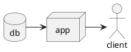

# react_task1_ex1_work

> quote

|       | field1 | field2 |
|-------|:------:|-------:|
| row 1 | cell1  | cell2  |
| row 2 | cell3  | cell4  |



```plantumlcode
@startuml component
actor client
node app
database db

db -> app
app -> client
@enduml
```